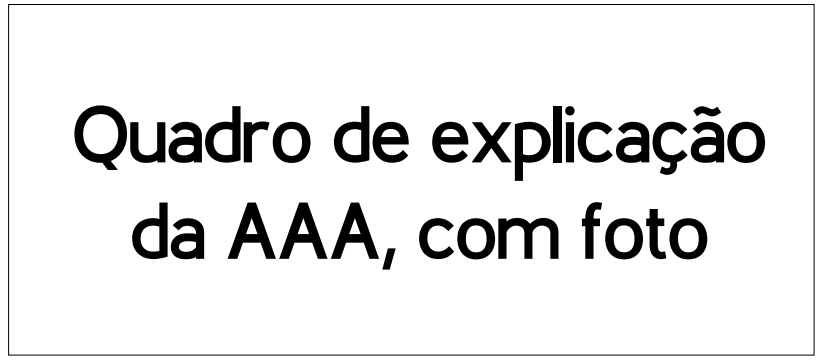

# Sobre

# Gestões

- Gestão Atual
- Velha Guarda

Obs: Ao clicar no ícone, apareceria uma tela (como no site do PET-BSI, na aba
“conteúdos”), com a foto, nome e diretoria dos membros e velha guarda.

# Treinos

- Atletismo
- Futcampo
- Basquete
- Futsal
- Handebol
- Natação
- Judô
- Tênis Campo
- Tênis Mesa
- Vôlei de Praia
- Vôlei
- Xadrez

Obs: Funcionaria como a Aba “Gestões”, porém mostraria
as informações sobre os treinos de cada modalidade

# Torcida

- Naumteria Febre
- Amarela Texuguetes

Obs: Em cada caixa teria o logo das instituições, ao clicar no logo,
abriria um texto explicativo sobre ela

# Produtos

Banner que fica passando os produtos

# Clube de Parceiros

Inserir todos os logos aqui

# Galeria

Obs: Cada quadro redicionaria uma página, com a galeria de fotos das nossas ações
e eventos.

- Baticun Texugo da
- Páscoa Doa Unesp
- ...

# Contato

Localização

Mapa com a localização da Unesp

Mídias Sociais
